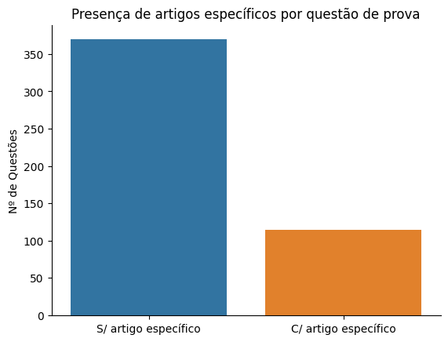
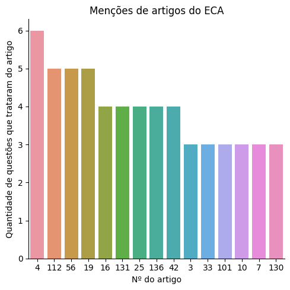
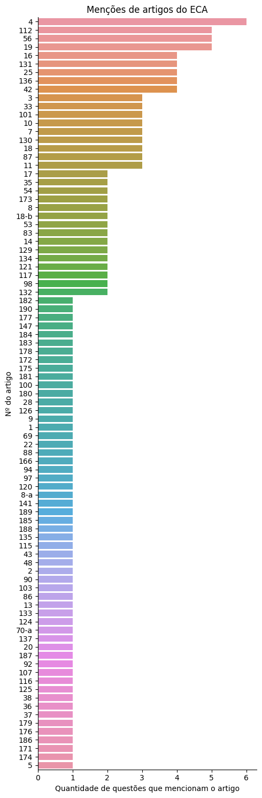
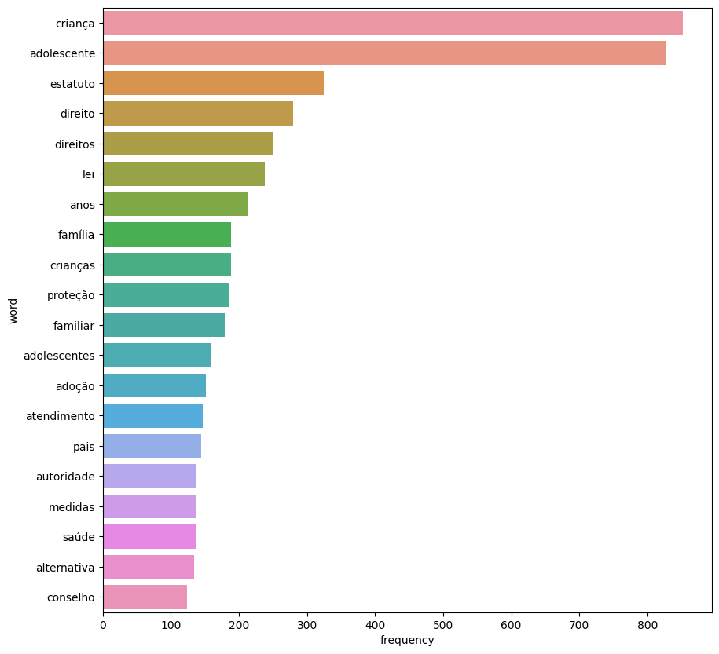
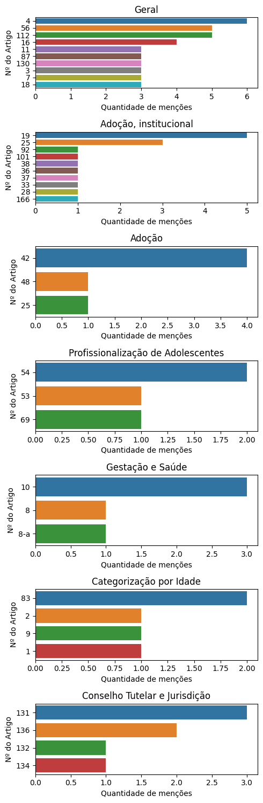

# Conjunto de Dados

De 4972 questões a respeito do ECA retiradas do QConcursos, 484 eram voltadas para provas de assistentes sociais.

Destas, 114 questões mencionam artigos de lei específicos.

## Análise de Artigos Pedidos Explicitamente

Como algumas questões mencionam mais de um artigo de lei, há a menção de 154 artigos em meio a estas 114 questões. O gráfico a seguir ilustra os 15 artigos mais pedidos:

Gráfico completo:

## Análise dos dados completos

Se considerarmos todos os dados, não só os que mencionam artigos, teremos as seguintes palavras como as mais citadas:

As três primeiras são resultado evidente de nossa busca por questões ligadas ao ECA; mas as demais podem vir a ser interessantes. Por exemplo, há considerável presença de questões mencionando proteção, adoção e saúde.

### Análise de tópicos

Com o uso da tecnologia de Processamento de Linguagem Natural (Bertopic), foi gerado um modelo de tópicos a respeito de nosso conjunto completo de questões.

<table border="1" class="dataframe">
  <thead>
    <tr style="text-align: right;">
      <th>Tema</th>
      <th>Quantidade</th>
      <th>Nome</th>
      <th>Palavras-chave</th>
      <th>Artigos mais pedidos</th>
    </tr>
  </thead>
  <tbody>
    <tr>
      <td>Geral</td>
      <td>265</td>
      <td>0_crianças_infância_infracional_direitos</td>
      <td>[crianças, infância, infracional, direitos, autoridade, criança, dignidade, liberdade, adolescentes, adolescente]</td>
      <td>4, 56, 112, 16, 11, 87, 130, 3, 7, 18</td>
    </tr>
    <tr>
      <td>Adoção, institucional</td>
      <td>58</td>
      <td>1_adoção_crianças_família_criança</td>
      <td>[adoção, crianças, família, criança, convivência, deverá, pais, comunitária, institucional, autoridade]</td>
      <td>19, 25, 92, 101, 38, 36, 37, 33, 28, 166</td>
    </tr>
    <tr>
      <td>Adoção</td>
      <td>41</td>
      <td>2_adoção_adotando_adotar_adotado</td>
      <td>[adoção, adotando, adotar, adotado, adotante, idade, criança, família, parentes, filho]</td>
      <td>42, 48, 25</td>
    </tr>
    <tr>
      <td>Profissionalização de Adolescentes</td>
      <td>33</td>
      <td>3_adolescentes_adolescente_menores_educativo</td>
      <td>[adolescentes, adolescente, menores, educativo, idade, educação, escolar, profissionalização, ensino, obrigatório]</td>
      <td>54, 53, 69</td>
    </tr>
    <tr>
      <td>Gestação e Saúde</td>
      <td>28</td>
      <td>4_neonato_gestação_nascimento_criança</td>
      <td>[neonato, gestação, nascimento, criança, público, públicos, mães, nascido, filhos, saúde]</td>
      <td>10, 8, 8-A</td>
    </tr>
    <tr>
      <td>Categorização por idade</td>
      <td>25</td>
      <td>5_idade_juventude_adolescente_adolescentes</td>
      <td>[idade, juventude, adolescente, adolescentes, criança, 18, anos, 16, judicial, 15]</td>
      <td>83, 2, 9, 1</td>
    </tr>
    <tr>
      <td>Conselho Tutelar e Jurisdição</td>
      <td>23</td>
      <td>6_jurisdicional_constitua_municipal_administrativa</td>
      <td>[jurisdicional, constitua, municipal, administrativa, município, administração, mandato, encarregado, direitos, sociedade]</td>
      <td>131, 136, 132, 134</td>
    </tr>
  </tbody>
</table>

A maioria das questões foi categorizada no tópico 0, com 265 questões, tratando dos temas dos direitos das crianças, sua dignidade e liberdade. Isso é um tanto genérico, visto que o ECA é inteiramente sobre isso, mas vejamos os próximos tópicos.

O segundo e terceiro tópico mais pedidos, somando 58 e 41 questões, são a respeito da adoção. O segundo tópico está mais ligado às palavras-chave 'comunitária' e 'institucional', incluindo o tema do acolhimento institucional, enquanto o terceiro trata mais especificamente da adoção em si. Isso significa que, desconsiderando temas gerais sobre o direito da criança, o tema da adoção é pedido em 99 das 484 questões analisadas.

O quarto tópico trata em especial da profissionalização de adolescentes, com 33 questões. Está incluso aqui em particular o vínculo de jovem aprendiz. O quinto tópico trata da gestação e da saúde em geral, com 28 questões. O sexto tópico trata da idade de crianças e adolescentes, com questões referentes a até qual idade uma pessoa é considerada pertencente a uma das categorias. Por fim, o último tópico se refere principalmente ao Conselho Tutelar e jurisdições relacionadas, com 23 questões.

A coluna à direita trata de todos os artigos pedidos dentro de uma categoria por ordem de relevância. Vale lembrar que estamos fazendo uso de 484 questões, das quais somente 114 mencionam artigos. O total de artigos mencionados são 154. Isso significa que os artigos associados a cada tópico frequentemente não são citados no mesmo, mas o estudo dos mesmos pode ser útil para tratar do tópico.

Obs.: Como o tópico Geral tem 265 questões, os artigos mencionados são muito variados e acaba sendo pouco útil para nossos propósitos; foram incluídos somente os 10 artigos mais pedidos.

