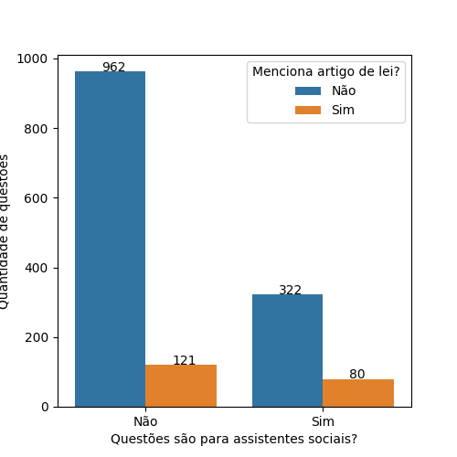
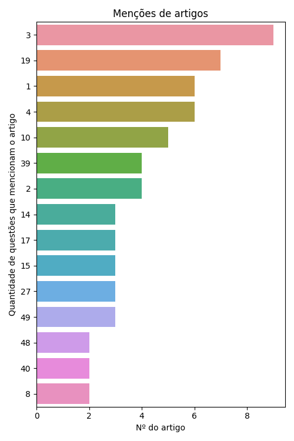
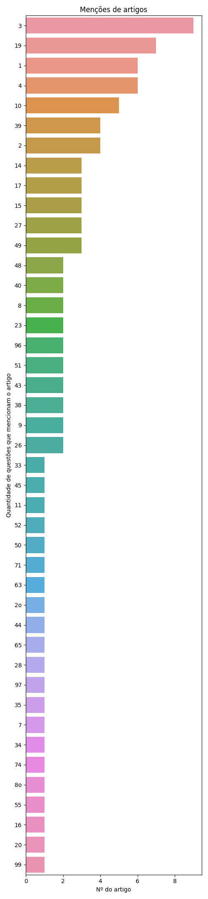
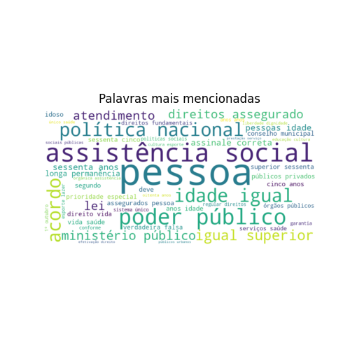
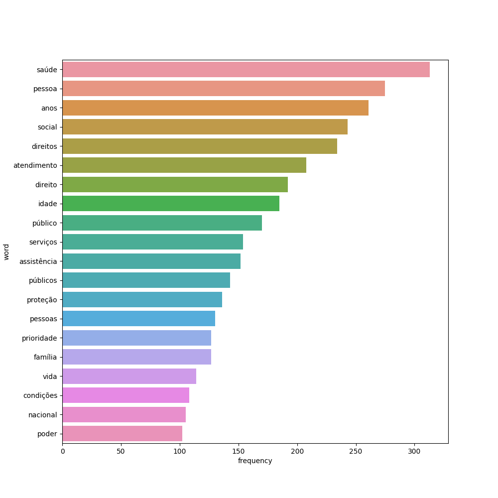
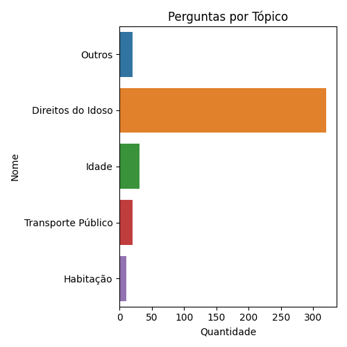
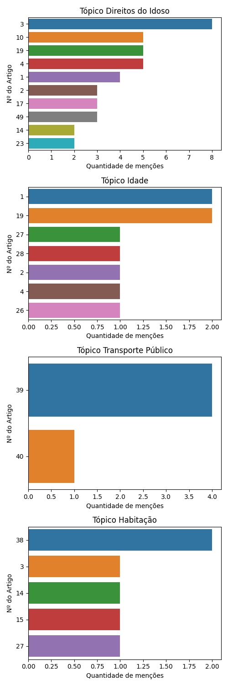

# Estatuto do Idoso

De 1485 questões a respeito da legislação Estatuto do Idoso retiradas do QConcursos, 402 eram voltadas para provas de assistentes sociais.

Destas, 80 questões mencionam artigos de lei específicos.

## Análise de Artigos Pedidos Explicitamente

Como algumas questões mencionam mais de um artigo de lei, há a menção de 97 artigos em meio a estas 80 questões. O gráfico a seguir ilustra os 15 artigos mais pedidos:

Gráfico completo:

## Análise dos demais dados

Se considerarmos todos os dados, não só os que mencionam artigos, teremos as seguintes palavras como as mais citadas:

### Análise de tópicos

Com o uso da tecnologia de Processamento de Linguagem Natural (Bertopic), foi gerado um modelo de tópicos a respeito de nosso conjunto completo de questões. Estes tópicos organizam quais os principais grupos de questão associados à lei em questão.

<table border="1" class="dataframe">
  <thead>
    <tr style="text-align: right;">
      <th></th>
      <th>Topic</th>
      <th>topic_title</th>
      <th>Representation</th>
      <th>Count</th>
    </tr>
  </thead>
  <tbody>
    <tr>
      <th>0</th>
      <td>-1</td>
      <td>Outros</td>
      <td>[afirmativas, afirmativa, correta, duas, errado, idosos, idosas, adequar, direito, falsa]</td>
      <td>20</td>
    </tr>
    <tr>
      <th>1</th>
      <td>0</td>
      <td>Direitos do Idoso</td>
      <td>[idosos, obrigação, idosa, direitos, idoso, liberdade, sociais, idade, dignidade, assegurado]</td>
      <td>320</td>
    </tr>
    <tr>
      <th>2</th>
      <td>1</td>
      <td>Idade</td>
      <td>[envelhecimento, idosos, idosa, idade, população, idoso, brasil, brasileira, sociedade, anos]</td>
      <td>31</td>
    </tr>
    <tr>
      <th>3</th>
      <td>2</td>
      <td>Transporte Público</td>
      <td>[transportes, transporte, idosas, veículos, idosos, urbanos, veículo, legislação, públicos, alternativas]</td>
      <td>20</td>
    </tr>
    <tr>
      <th>4</th>
      <td>3</td>
      <td>Habitação</td>
      <td>[habitacionais, residenciais, habitação, idosos, prioridade, pensão, públicos, aposentadoria, idosa, subsidiados]</td>
      <td>11</td>
    </tr>
  </tbody>
</table>

Se observarmos os artigos pedidos em cada tópico, teremos os seguintes gráficos:

