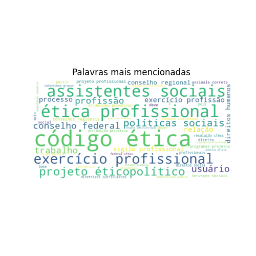

# Lei de Regulamentação

De 3890 questões a respeito da legislação Lei de Regulamentação retiradas do QConcursos, 3479 eram voltadas para provas de assistentes sociais.

Destas, 298 questões mencionam artigos de lei específicos.

## Análise de Artigos Pedidos Explicitamente

Como algumas questões mencionam mais de um artigo de lei, há a menção de 317 artigos em meio a estas 298 questões. O gráfico a seguir ilustra os 15 artigos mais pedidos:

Gráfico completo:

## Análise dos demais dados

Se considerarmos todos os dados, não só os que mencionam artigos, teremos as seguintes palavras como as mais citadas:

### Análise de tópicos

Com o uso da tecnologia de Processamento de Linguagem Natural (Bertopic), foi gerado um modelo de tópicos a respeito de nosso conjunto completo de questões. Estes tópicos organizam quais os principais grupos de questão associados à lei em questão.

<table border="1" class="dataframe">
  <thead>
    <tr style="text-align: right;">
      <th></th>
      <th>Topic</th>
      <th>topic_title</th>
      <th>Representation</th>
      <th>Count</th>
    </tr>
  </thead>
  <tbody>
    <tr>
      <th>0</th>
      <td>-1</td>
      <td>Outros</td>
      <td>[ética, ético, sociais, profissão, competências, profissionais, competência, atribuições, sociedade, regulamentação]</td>
      <td>1123</td>
    </tr>
    <tr>
      <th>1</th>
      <td>0</td>
      <td>Ética e Responsabilidade Social do Assistente</td>
      <td>[ética, responsabilidade, responsabilidades, sociais, institucionais, direitos, atribuições, social, instituições, assistente]</td>
      <td>294</td>
    </tr>
    <tr>
      <th>2</th>
      <td>1</td>
      <td>Ética Societária e Política Social</td>
      <td>[ético, societário, ética, societários, sociais, sociedade, social, política, político, conservadorismo]</td>
      <td>166</td>
    </tr>
    <tr>
      <th>3</th>
      <td>2</td>
      <td>Políticas Sociais e a Sociedade Brasileira</td>
      <td>[sociais, políticas, sociedade, brasil, política, brasileiro, político, brasileiros, brasileira, social]</td>
      <td>158</td>
    </tr>
    <tr>
      <th>4</th>
      <td>3</td>
      <td>Ética e Moralidade na Sociedade Capitalista</td>
      <td>[éticas, ético, éticos, ética, moralidade, moral, morais, consciência, sociedade, capitalista]</td>
      <td>134</td>
    </tr>
    <tr>
      <th>5</th>
      <td>4</td>
      <td>Ética e Autoritarismo na Democracia</td>
      <td>[ético, ética, autoritarismo, liberdade, equidade, emancipação, socialização, democracia, sociais, autonomia]</td>
      <td>92</td>
    </tr>
    <tr>
      <th>6</th>
      <td>5</td>
      <td>Supervisão e Responsabilidade Profissional do Assistente</td>
      <td>[supervisão, supervisionado, supervisores, supervisor, responsabilidade, assistente, atribuição, instituição, pedagógico, profissional]</td>
      <td>83</td>
    </tr>
    <tr>
      <th>7</th>
      <td>6</td>
      <td>Ética e Proteção dos Interesses Profissionais</td>
      <td>[protegerá, ética, assistente, autoridade, admissível, profissional, interesses, revelar, constitui, multidisciplinar]</td>
      <td>82</td>
    </tr>
    <tr>
      <th>8</th>
      <td>7</td>
      <td>Penalidades e Infrações na Conduta Profissional</td>
      <td>[penalizado, penalidades, punibilidade, penalidade, infrações, interdição, multas, infração, disciplinar, advertência]</td>
      <td>81</td>
    </tr>
    <tr>
      <th>9</th>
      <td>8</td>
      <td>Atribuições e Ética no Atendimento Social</td>
      <td>[assistente, atendimento, assistentes, sociais, situação, ética, serviço, atribuições, profissional, serviços]</td>
      <td>67</td>
    </tr>
    <tr>
      <th>10</th>
      <td>9</td>
      <td>Competências Interdisciplinares do Profissional Assistente</td>
      <td>[profissão, profissionais, sociais, sociedade, interdisciplinar, assessoria, competências, interesses, assistentes, profissional]</td>
      <td>64</td>
    </tr>
    <tr>
      <th>11</th>
      <td>10</td>
      <td>Educação e Desenvolvimento Social</td>
      <td>[educação, sociedade, ensino, sociais, curriculares, acadêmica, social, desenvolvimento, prática, política]</td>
      <td>61</td>
    </tr>
    <tr>
      <th>12</th>
      <td>11</td>
      <td>Autoridade e Ética na Atuação Institucional</td>
      <td>[sociais, institucional, institucionais, sistematização, pública, atendimento, social, autoridade, ética, interesses]</td>
      <td>59</td>
    </tr>
    <tr>
      <th>13</th>
      <td>12</td>
      <td>Regulamentação e Organizações Profissionais</td>
      <td>[instituições, regulamentação, atribuições, organizações, ética, jurisdição, diretoria, jurisprudência, federal, assembleia]</td>
      <td>54</td>
    </tr>
    <tr>
      <th>14</th>
      <td>13</td>
      <td>Currículo e Prática Acadêmica Interdisciplinar</td>
      <td>[pedagógico, currículo, acadêmica, ensino, curriculares, sociedade, interdisciplinaridade, curso, acadêmico, prática]</td>
      <td>52</td>
    </tr>
    <tr>
      <th>15</th>
      <td>14</td>
      <td>Regulamentação e Supervisão dos Serviços Privados</td>
      <td>[privativas, supervisionar, regulamentação, regulamenta, assessoria, atribuições, profissão, privadas, administração, serviços]</td>
      <td>51</td>
    </tr>
    <tr>
      <th>16</th>
      <td>15</td>
      <td>Comissão e Atribuições dos Assistentes Sociais</td>
      <td>[assistentes, comissão, atribuição, assistente, profissionais, serviço, social, competência, profissional, opiniões]</td>
      <td>49</td>
    </tr>
    <tr>
      <th>17</th>
      <td>16</td>
      <td>Projetos e Objetivos das Profissões Sociais</td>
      <td>[profissão, profissionais, projetos, profissional, instituições, profissões, societários, projeto, objetivos, sociais]</td>
      <td>48</td>
    </tr>
    <tr>
      <th>18</th>
      <td>17</td>
      <td>Normatização e Consultoria Federativa</td>
      <td>[federativa, federal, normativo, constituem, assessoria, sociais, atribuições, consultiva, fiscalizar, normatizar]</td>
      <td>48</td>
    </tr>
    <tr>
      <th>19</th>
      <td>18</td>
      <td>Ética e Competência do Assistente no Judiciário</td>
      <td>[ética, autoridade, assistente, judiciário, atribuição, competente, justiça, profissional, depoimento, competência]</td>
      <td>48</td>
    </tr>
    <tr>
      <th>20</th>
      <td>19</td>
      <td>Políticas Sociais e Administração de Serviços</td>
      <td>[sociais, sociedade, organizações, assessoria, políticas, administração, social, constituem, serviços, competências]</td>
      <td>46</td>
    </tr>
    <tr>
      <th>21</th>
      <td>20</td>
      <td>Reforma Socioassistencial e Política de Saúde</td>
      <td>[socioassistenciais, reforma, políticas, saúde, sociais, descentralização, alternativas, ético, terapêuticas, política]</td>
      <td>38</td>
    </tr>
    <tr>
      <th>22</th>
      <td>21</td>
      <td>Ética e Regulamentação Societária</td>
      <td>[ético, ética, éticos, sociais, equidade, normas, social, direitos, regulamentação, regulamenta]</td>
      <td>37</td>
    </tr>
    <tr>
      <th>23</th>
      <td>22</td>
      <td>Atribuições e Administração de Serviços Sociais Privados</td>
      <td>[sociais, privativas, privadas, assessoria, serviços, social, socioeconômicos, supervisionar, administração, atribuições]</td>
      <td>37</td>
    </tr>
    <tr>
      <th>24</th>
      <td>23</td>
      <td>Ética e Princípios</td>
      <td>[éticos, ética, ético, doutrina, eticopolítico, filosófica, conservadorismo, equidade, princípios, sociedade]</td>
      <td>36</td>
    </tr>
    <tr>
      <th>25</th>
      <td>24</td>
      <td>Atendimento e Abordagens Éticas do Assistente Social</td>
      <td>[assistentes, atendimento, atendimentos, assistente, serviços, éticas, informar, social, profissional, abordagens]</td>
      <td>36</td>
    </tr>
    <tr>
      <th>26</th>
      <td>25</td>
      <td>Discriminação e Conduta Profissional</td>
      <td>[discriminatórias, normas, discriminação, conduta, condutas, sociais, preconceito, preconceitos, social, profissionais]</td>
      <td>29</td>
    </tr>
    <tr>
      <th>27</th>
      <td>26</td>
      <td>Legislação e Fiscalização da Profissão</td>
      <td>[profissão, sociais, atribuições, contratados, profissionais, legislação, administração, regulamentação, fiscais, profissional]</td>
      <td>29</td>
    </tr>
    <tr>
      <th>28</th>
      <td>27</td>
      <td>Pesquisa e Intervenção Socioeconômica</td>
      <td>[socioeconômicos, sociais, pesquisas, pesquisa, estudo, investigação, crítica, investigativa, estudos, interventiva]</td>
      <td>28</td>
    </tr>
    <tr>
      <th>29</th>
      <td>28</td>
      <td>Ações Afirmativas e Direitos Iguais</td>
      <td>[afirmativas, afirmativa, corretas, correta, direitos, dignidade, escravidão, iguais, direita, duas]</td>
      <td>25</td>
    </tr>
    <tr>
      <th>30</th>
      <td>29</td>
      <td>Ética e Responsabilidade Profissional na Legislação</td>
      <td>[ética, éticos, profissão, institucionais, equidade, profissionais, responsabilidade, profissional, regulamentação, legislação]</td>
      <td>23</td>
    </tr>
    <tr>
      <th>31</th>
      <td>30</td>
      <td>Democracia e Políticas Equitativas</td>
      <td>[democracia, políticas, democráticas, equidade, política, sociais, clientelismo, discriminados, discussão, alternativas]</td>
      <td>22</td>
    </tr>
    <tr>
      <th>32</th>
      <td>31</td>
      <td>Infrações e Disciplina Profissional</td>
      <td>[disciplinares, disciplinar, profissão, infração, infrações, ética, autoridade, profissional, instituição, competência]</td>
      <td>22</td>
    </tr>
    <tr>
      <th>33</th>
      <td>32</td>
      <td>Liberdades e Direitos Fundamentais</td>
      <td>[liberdades, direitos, dignidade, justiça, igualdade, impotência, fundamentais, cidadania, sociais, perseguição]</td>
      <td>21</td>
    </tr>
    <tr>
      <th>34</th>
      <td>33</td>
      <td>Supervisão e Administração de Serviços Sociais Privativos</td>
      <td>[privativas, privadas, serviços, sociais, supervisão, assessoria, supervisionar, sociedade, atribuições, administração]</td>
      <td>21</td>
    </tr>
    <tr>
      <th>35</th>
      <td>34</td>
      <td>Ética e Correções Gramaticais na Categoria de Assistente Social</td>
      <td>[ética, alterações, correções, categoria, assistente, publicadas, gramaticais, aprovado, 1993, expressas]</td>
      <td>18</td>
    </tr>
    <tr>
      <th>36</th>
      <td>35</td>
      <td>Confidencialidade e Segurança na Documentação do Serviço</td>
      <td>[confidencial, divulgação, cfess, documentação, segurança, responsável, salvaguarda, documentos, viabiliza, serviço]</td>
      <td>16</td>
    </tr>
    <tr>
      <th>37</th>
      <td>36</td>
      <td>Graduação e Competência do Assistente Social no Brasil</td>
      <td>[profissão, sociais, brasil, brasileiro, diploma, social, graduação, ensino, competente, estrangeiros]</td>
      <td>16</td>
    </tr>
    <tr>
      <th>38</th>
      <td>37</td>
      <td>Jornada de Trabalho e Remuneração na Profissão</td>
      <td>[horas, duração, empregador, salarial, salário, semanais, semana, trabalho, profissão, serviço]</td>
      <td>16</td>
    </tr>
    <tr>
      <th>39</th>
      <td>38</td>
      <td>Instituições Competentes e Atendimento Público</td>
      <td>[competentes, instituições, atendimento, profissionais, pública, profissão, assistentes, legislação, assistente, profissional]</td>
      <td>16</td>
    </tr>
    <tr>
      <th>40</th>
      <td>39</td>
      <td>Políticas Sociais e Demandas Humanas</td>
      <td>[sociais, societário, social, sociedade, políticas, socialismo, humanização, serviços, políticos, demandas]</td>
      <td>15</td>
    </tr>
    <tr>
      <th>41</th>
      <td>40</td>
      <td>Normas e Disciplina Profissional do CFESS</td>
      <td>[cfess, normas, regulamentar, condutas, disciplinares, serviço, resoluções, normatizam, federal, disciplinar]</td>
      <td>14</td>
    </tr>
    <tr>
      <th>42</th>
      <td>41</td>
      <td>Desafios e Propostas para a Atuação do Assistente Social</td>
      <td>[assistentes, intervenção, imperativo, desafios, necessidades, sociais, propostas, assistente, profissão, demandas]</td>
      <td>13</td>
    </tr>
    <tr>
      <th>43</th>
      <td>42</td>
      <td>Regulamentação e Disciplina Ocupacional no Brasil</td>
      <td>[normativos, regulamentam, profissão, disciplina, ocupacional, regulamentação, profissionais, regulamenta, brasil, brasileiro]</td>
      <td>13</td>
    </tr>
    <tr>
      <th>44</th>
      <td>43</td>
      <td>Competências Multiprofissionais do Assistente Social</td>
      <td>[interprofissionais, multidisciplinar, profissionais, interdisciplinar, assistente, competências, profissional, multiprofissionais, multiprofissional, social]</td>
      <td>13</td>
    </tr>
    <tr>
      <th>45</th>
      <td>44</td>
      <td>Ética e Sociabilidade na Profissão</td>
      <td>[sociabilidade, éticas, ética, sociedade, moral, profissão, social, serviço, constituem, profissional]</td>
      <td>12</td>
    </tr>
    <tr>
      <th>46</th>
      <td>45</td>
      <td>Estudos Socioeconômicos e Análise da Atuação Profissional</td>
      <td>[social, estudo, socioeconômicos, estudada, estudos, pesquisa, avaliação, análise, afirmações, profissão]</td>
      <td>11</td>
    </tr>
    <tr>
      <th>47</th>
      <td>46</td>
      <td>Direitos e Administração de Serviços Privados na Regulamentação</td>
      <td>[assessoria, sociais, regulamenta, direitos, constitui, privativas, administração, privadas, atribuições, profissionais]</td>
      <td>11</td>
    </tr>
    <tr>
      <th>48</th>
      <td>47</td>
      <td>Fiscalização e Normas Disciplinadoras na Profissão</td>
      <td>[fiscal, normativa, reguladores, comissão, fiscais, nacional, normas, pnf, disciplinadora, compromissos]</td>
      <td>11</td>
    </tr>
    <tr>
      <th>49</th>
      <td>48</td>
      <td>Societárias e Políticas Sociais na Atuação Profissional</td>
      <td>[societárias, sociais, social, profissão, interdisciplinaridade, profissionais, profissões, políticas, profissional, serviço]</td>
      <td>10</td>
    </tr>
    <tr>
      <th>50</th>
      <td>49</td>
      <td>Responsabilidade e Autoridade Profissional nas Organizações Interdisciplinares</td>
      <td>[profissionais, responsabilidade, subordinado, autoridade, profissional, profissões, interdisciplinar, organizações, assistente, éticos]</td>
      <td>10</td>
    </tr>
  </tbody>
</table>

Se observarmos os artigos pedidos em cada tópico, teremos os seguintes gráficos:

