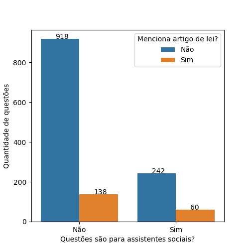
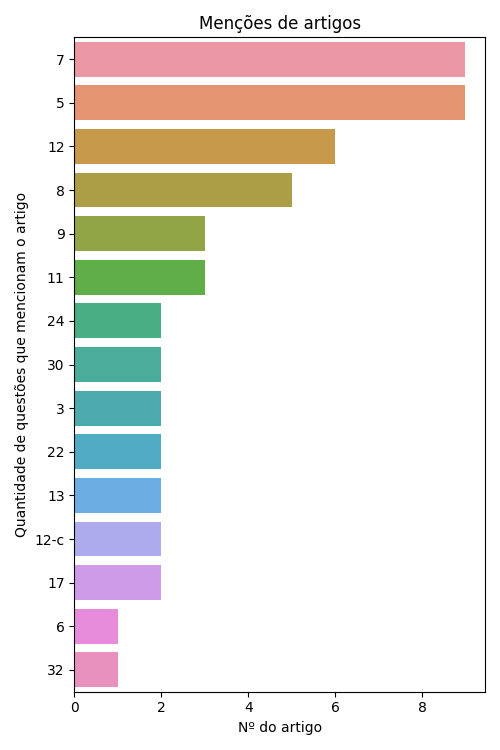
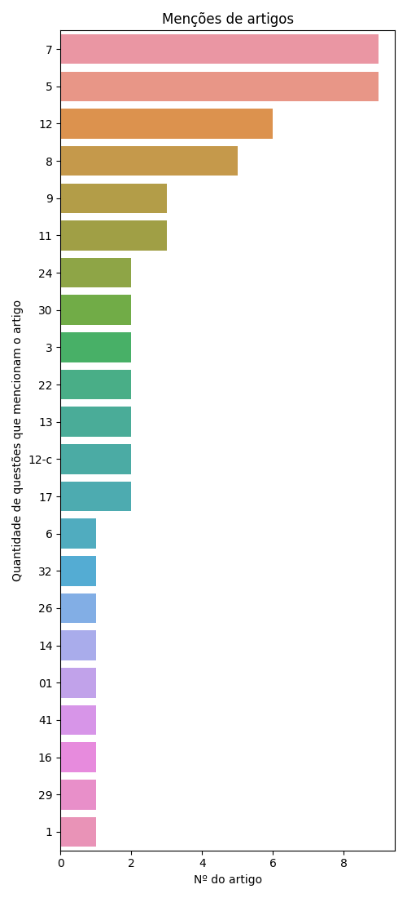
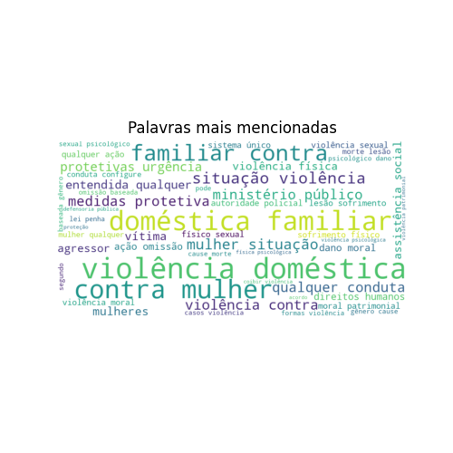
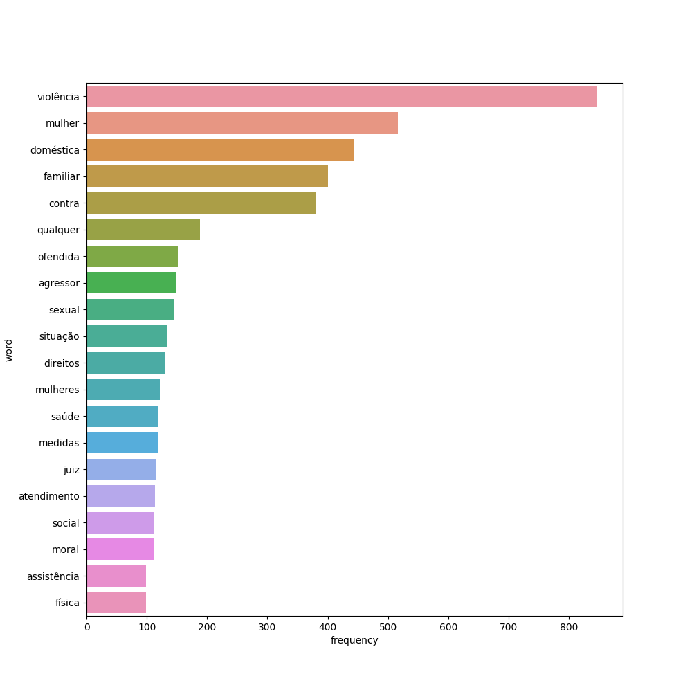
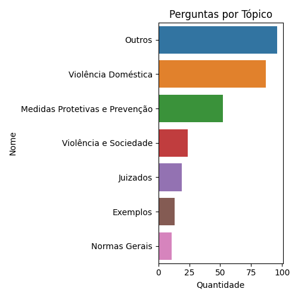
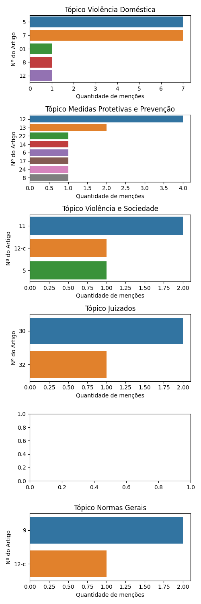

# Lei Maria da Penha

De 1358 questões a respeito da legislação Lei Maria da Penha retiradas do QConcursos, 302 eram voltadas para provas de assistentes sociais.

Destas, 60 questões mencionam artigos de lei específicos.

## Análise de Artigos Pedidos Explicitamente

Como algumas questões mencionam mais de um artigo de lei, há a menção de 58 artigos em meio a estas 60 questões. O gráfico a seguir ilustra os 15 artigos mais pedidos:

Gráfico completo:

## Análise dos demais dados

Se considerarmos todos os dados, não só os que mencionam artigos, teremos as seguintes palavras como as mais citadas:

### Análise de tópicos

Com o uso da tecnologia de Processamento de Linguagem Natural (Bertopic), foi gerado um modelo de tópicos a respeito de nosso conjunto completo de questões. Estes tópicos organizam quais os principais grupos de questão associados à lei em questão.

<table border="1" class="dataframe">
  <thead>
    <tr style="text-align: right;">
      <th></th>
      <th>Topic</th>
      <th>topic_title</th>
      <th>Representation</th>
      <th>Count</th>
    </tr>
  </thead>
  <tbody>
    <tr>
      <th>0</th>
      <td>-1</td>
      <td>Outros</td>
      <td>[violência, políticas, mulheres, direitos, pública, política, público, federal, medidas, mulher]</td>
      <td>96</td>
    </tr>
    <tr>
      <th>1</th>
      <td>0</td>
      <td>Violência Doméstica</td>
      <td>[violência, mulheres, conduta, sofrimento, relação, mulher, indivíduos, cause, gênero, difamação]</td>
      <td>87</td>
    </tr>
    <tr>
      <th>2</th>
      <td>1</td>
      <td>Medidas Protetivas e Prevenção</td>
      <td>[penal, autoridade, violência, ofendida, preventiva, agressor, casos, prisão, caso, restrição]</td>
      <td>52</td>
    </tr>
    <tr>
      <th>3</th>
      <td>2</td>
      <td>Violência e Sociedade</td>
      <td>[violencia, violência, brasileira, brasil, mulheres, sociedade, ofendida, autoridade, vítimas, legislação]</td>
      <td>24</td>
    </tr>
    <tr>
      <th>4</th>
      <td>3</td>
      <td>Juizados</td>
      <td>[defensoria, multidisciplinar, atendimento, atribuições, violência, fornecer, jurídica, proposta, subsecutivo, profissionais]</td>
      <td>19</td>
    </tr>
    <tr>
      <th>5</th>
      <td>4</td>
      <td>Exemplos</td>
      <td>[maria, mariana, homicídio, autor, elza, mulher, violência, mãe, filha, ela]</td>
      <td>13</td>
    </tr>
    <tr>
      <th>6</th>
      <td>5</td>
      <td>Normas Gerais</td>
      <td>[violência, mulheres, normas, políticas, legal, direitos, mulher, ofendida, situação, necessário]</td>
      <td>11</td>
    </tr>
  </tbody>
</table>

Se observarmos os artigos pedidos em cada tópico, teremos os seguintes gráficos:

