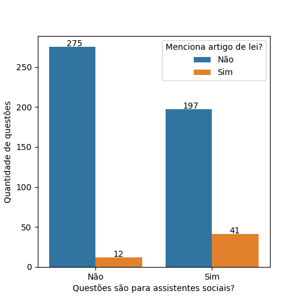
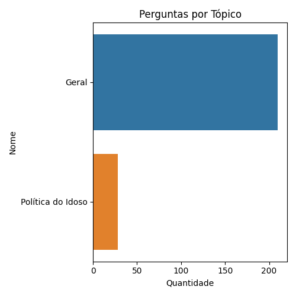
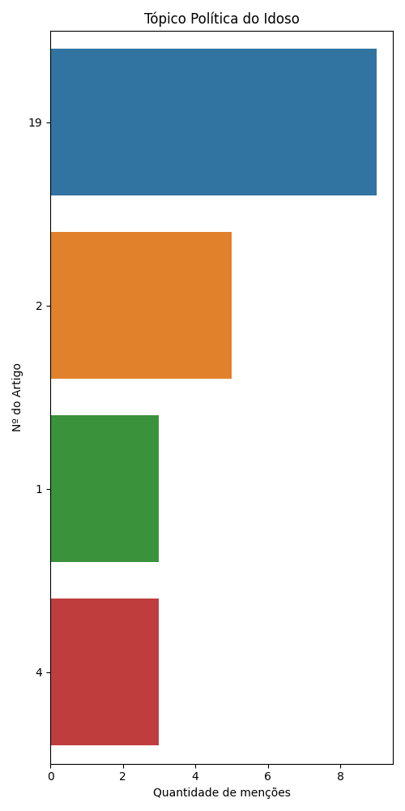

# Política Nacional do Idoso

De 525 questões a respeito da legislação Política Nacional do Idoso retiradas do QConcursos, 238 eram voltadas para provas de assistentes sociais.

Destas, 41 questões mencionam artigos de lei específicos.

## Análise de Artigos Pedidos Explicitamente

Como algumas questões mencionam mais de um artigo de lei, há a menção de 36 artigos em meio a estas 41 questões. O gráfico a seguir ilustra os artigos pedidos:

## Análise dos demais dados

Se considerarmos todos os dados, não só os que mencionam artigos, teremos as seguintes palavras como as mais citadas:

### Análise de tópicos

Com o uso da tecnologia de Processamento de Linguagem Natural (Bertopic), foi gerado um modelo de tópicos a respeito de nosso conjunto completo de questões. Estes tópicos organizam quais os principais grupos de questão associados à lei em questão.

<table border="1" class="dataframe">
  <thead>
    <tr style="text-align: right;">
      <th></th>
      <th>Topic</th>
      <th>topic_title</th>
      <th>Representation</th>
      <th>Count</th>
    </tr>
  </thead>
  <tbody>
    <tr>
      <th>0</th>
      <td>0</td>
      <td>Geral</td>
      <td>[sociedade, políticas, sociais, idosos, envelhecimento, idosa, social, benefício, direitos, saúde]</td>
      <td>210</td>
    </tr>
    <tr>
      <th>1</th>
      <td>1</td>
      <td>Política do Idoso</td>
      <td>[envelhecimento, políticas, idosos, sociedade, idosa, brasil, brasileira, população, idade, idoso]</td>
      <td>28</td>
    </tr>
  </tbody>
</table>

Se observarmos os artigos pedidos em cada tópico, teremos os seguintes gráficos:

