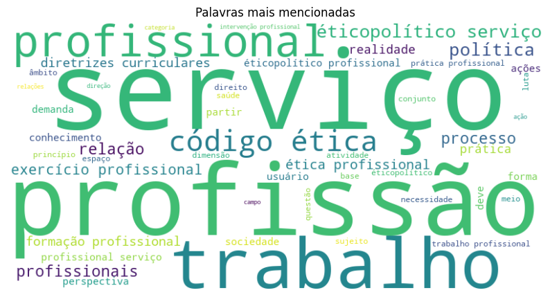
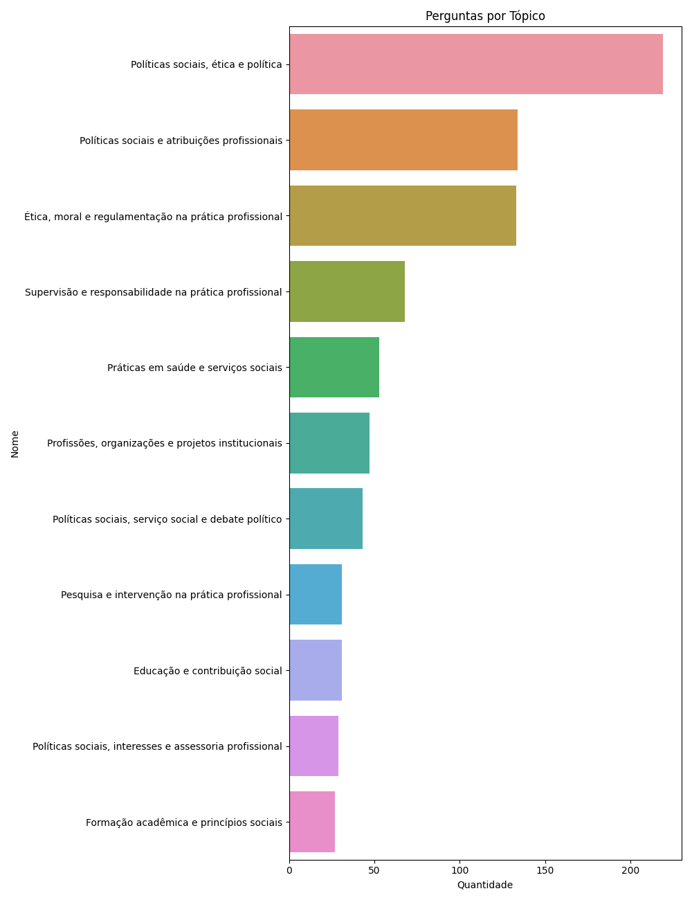
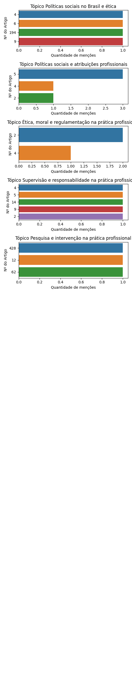

# Projeto Ético-Político

De 1355 questões a respeito do Projeto Ético-Político da Assistência Social retiradas do QConcursos, 1282 eram voltadas para provas de assistentes sociais.

Destas, 29 questões mencionam artigos de lei específicos.

## Análise de Artigos Pedidos Explicitamente

Como algumas questões mencionam mais de um artigo de lei, há a menção de 28 artigos em meio a estas 29 questões. O gráfico a seguir ilustra os 15 artigos mais pedidos:

Gráfico completo:

## Análise dos demais dados

Se considerarmos todos os dados, não só os que mencionam artigos, teremos as seguintes palavras como as mais citadas:

### Análise de tópicos

Com o uso da tecnologia de Processamento de Linguagem Natural (Bertopic), foi gerado um modelo de tópicos a respeito de nosso conjunto completo de questões. Estes tópicos organizam quais os principais grupos de questão associados à lei em questão.

<table border="1" class="dataframe">
  <thead>
    <tr style="text-align: right;">
      <th></th>
      <th>Topic</th>
      <th>topic_title</th>
      <th>Representation</th>
      <th>Count</th>
    </tr>
  </thead>
  <tbody>
    <tr>
      <th>0</th>
      <td>-1</td>
      <td>Ética e Políticas Sociais na Profissão</td>
      <td>[profissão, sociedade, ético, profissionais, ética, políticas, sociais, interesses, profissional, prática]</td>
      <td>266</td>
    </tr>
    <tr>
      <th>1</th>
      <td>0</td>
      <td>Conservadorismo e Política Social na Sociedade</td>
      <td>[societário, sociais, ético, ética, sociedade, políticas, social, política, político, conservadorismo]</td>
      <td>229</td>
    </tr>
    <tr>
      <th>2</th>
      <td>1</td>
      <td>Políticas Sociais Brasileiras e Conservadorismo</td>
      <td>[sociedade, sociais, políticas, brasil, brasileiro, brasileira, social, política, político, conservadorismo]</td>
      <td>219</td>
    </tr>
    <tr>
      <th>3</th>
      <td>2</td>
      <td>Regulamentação e Princípios Éticos na Prática Social</td>
      <td>[ética, ético, moral, sociais, regulamentação, social, profissão, direitos, políticas, princípios]</td>
      <td>136</td>
    </tr>
    <tr>
      <th>4</th>
      <td>3</td>
      <td>Atribuições Profissionais dos Assistentes Sociais</td>
      <td>[sociais, profissão, institucional, profissionais, assistentes, ocupacionais, atribuições, assessoria, social, assistente]</td>
      <td>106</td>
    </tr>
    <tr>
      <th>5</th>
      <td>4</td>
      <td>Supervisão e Responsabilidade Profissional na Instituição</td>
      <td>[supervisão, supervisionado, supervisores, supervisor, responsabilidade, obrigatório, assistente, profissionais, instituição, ensino]</td>
      <td>67</td>
    </tr>
    <tr>
      <th>6</th>
      <td>5</td>
      <td>Reforma dos Serviços de Saúde e Ética Profissional</td>
      <td>[saúde, sociais, políticas, práticas, atendimento, reforma, serviços, ético, profissionais, alternativas]</td>
      <td>56</td>
    </tr>
    <tr>
      <th>7</th>
      <td>6</td>
      <td>Organizações e Projetos Institucionais na Profissão</td>
      <td>[profissão, profissionais, profissional, organizações, projetos, institucionais, instituições, profissões, societários, objetivos]</td>
      <td>42</td>
    </tr>
    <tr>
      <th>8</th>
      <td>7</td>
      <td>Debate sobre o Capitalismo e Ética na Prática Social</td>
      <td>[sociais, sociedade, social, políticas, capitalista, profissão, debate, teoria, ético, ética]</td>
      <td>41</td>
    </tr>
    <tr>
      <th>9</th>
      <td>8</td>
      <td>Formação Acadêmica e Prática Profissional</td>
      <td>[formação, curriculares, prática, profissão, profissionais, acadêmica, curso, sociedade, princípios, capacitação]</td>
      <td>35</td>
    </tr>
    <tr>
      <th>10</th>
      <td>9</td>
      <td>Educação e Pedagogia Social na Sociedade</td>
      <td>[educação, educacionais, sociedade, educacional, pedagógica, sociais, ensino, social, subsídios, contribua]</td>
      <td>32</td>
    </tr>
    <tr>
      <th>11</th>
      <td>10</td>
      <td>Pesquisa e Intervenção Social na Profissão</td>
      <td>[investigativa, profissão, pesquisa, pesquisas, investigação, sociais, interventiva, profissionais, formativo, ensino]</td>
      <td>30</td>
    </tr>
    <tr>
      <th>12</th>
      <td>11</td>
      <td>Políticas Institucionais e Prática Profissional</td>
      <td>[políticas, institucional, institucionais, sociais, interesses, assessoria, prática, propostas, profissão, profissionais]</td>
      <td>23</td>
    </tr>
  </tbody>
</table>

Se observarmos os artigos pedidos em cada tópico, teremos os seguintes gráficos:

