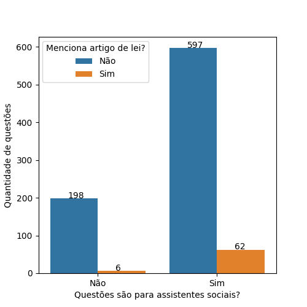
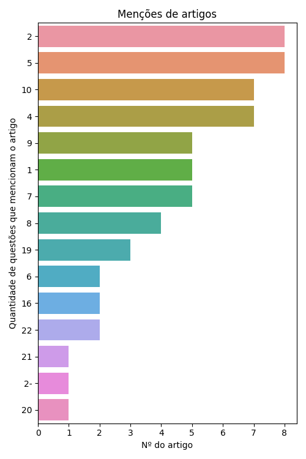
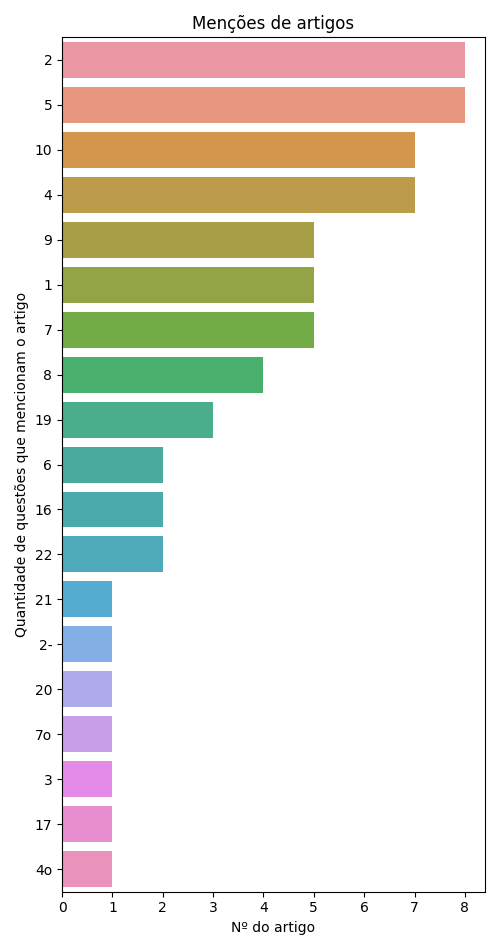
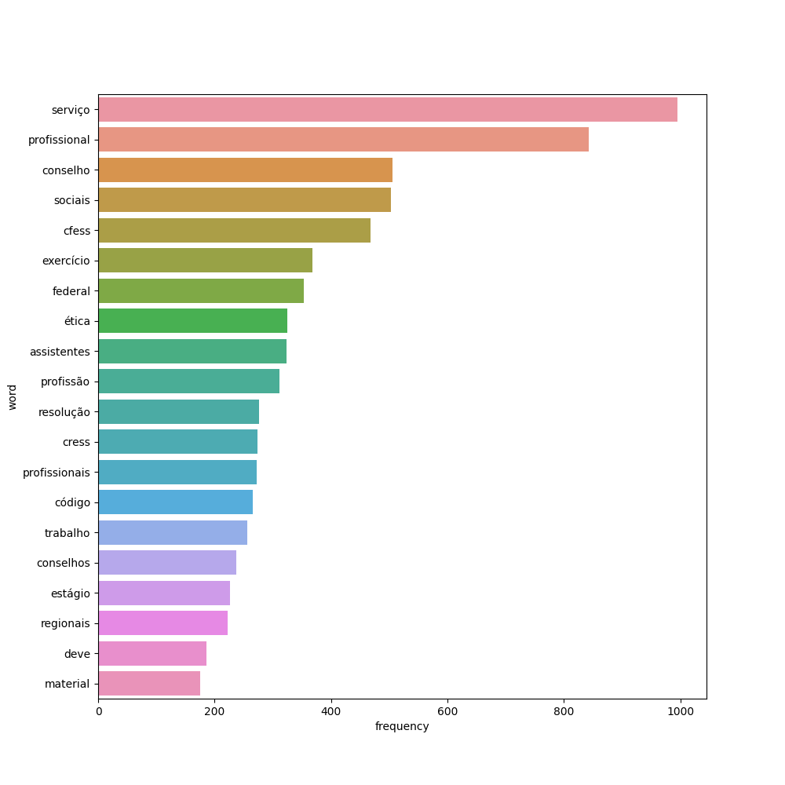
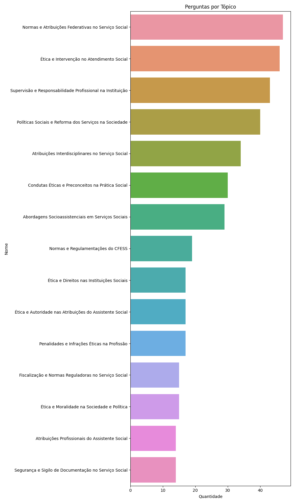
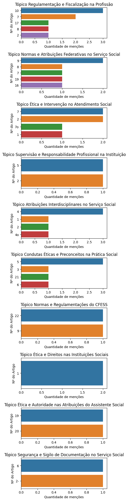

# Resoluções CFESS

De 863 questões a respeito das Resoluções do CFESS retiradas do QConcursos, 659 eram voltadas para provas de assistentes sociais.

Destas, 62 questões mencionam artigos de lei específicos.

## Análise de Artigos Pedidos Explicitamente

Como algumas questões mencionam mais de um artigo de lei, há a menção de 65 artigos em meio a estas 62 questões. O gráfico a seguir ilustra os 15 artigos mais pedidos:

Gráfico completo:

## Análise dos demais dados

Se considerarmos todos os dados, não só os que mencionam artigos, teremos as seguintes palavras como as mais citadas:

### Análise de tópicos

Com o uso da tecnologia de Processamento de Linguagem Natural (Bertopic), foi gerado um modelo de tópicos a respeito de nosso conjunto completo de questões. Estes tópicos organizam quais os principais grupos de questão associados à lei em questão.

<table border="1" class="dataframe">
  <thead>
    <tr style="text-align: right;">
      <th></th>
      <th>Topic</th>
      <th>topic_title</th>
      <th>Representation</th>
      <th>Count</th>
    </tr>
  </thead>
  <tbody>
    <tr>
      <th>0</th>
      <td>-1</td>
      <td>Atribuições Profissionais no Serviço Social</td>
      <td>[serviços, sociais, atribuições, serviço, profissionais, profissão, assistentes, atribuição, participação, profissional]</td>
      <td>197</td>
    </tr>
    <tr>
      <th>1</th>
      <td>0</td>
      <td>Regulamentação e Fiscalização na Profissão</td>
      <td>[regulamentação, assessoria, regulamenta, atribuições, fiscais, jurisdição, assistentes, profissionais, federal, profissão]</td>
      <td>65</td>
    </tr>
    <tr>
      <th>2</th>
      <td>1</td>
      <td>Normas e Atribuições Federativas no Serviço Social</td>
      <td>[normativo, instituições, federativa, federal, regulamentação, constituem, assessoria, consultiva, atribuições, fiscalizar]</td>
      <td>47</td>
    </tr>
    <tr>
      <th>3</th>
      <td>2</td>
      <td>Ética e Intervenção no Atendimento Social</td>
      <td>[atendimento, atendimentos, assistente, serviços, serviço, intervenção, éticas, informar, profissional, social]</td>
      <td>46</td>
    </tr>
    <tr>
      <th>4</th>
      <td>3</td>
      <td>Supervisão e Responsabilidade Profissional na Instituição</td>
      <td>[supervisão, supervisionado, supervisor, responsabilidade, assistente, profissionais, atribuição, instituição, profissional, ensino]</td>
      <td>43</td>
    </tr>
    <tr>
      <th>5</th>
      <td>4</td>
      <td>Políticas Sociais e Reforma dos Serviços na Sociedade</td>
      <td>[sociedade, sociais, políticas, social, serviços, associação, profissionais, serviço, profissão, reforma]</td>
      <td>40</td>
    </tr>
    <tr>
      <th>6</th>
      <td>5</td>
      <td>Atribuições Interdisciplinares no Serviço Social</td>
      <td>[atribuições, interdisciplinar, assistente, profissionais, social, atribuição, serviços, intervenção, serviço, competências]</td>
      <td>34</td>
    </tr>
    <tr>
      <th>7</th>
      <td>6</td>
      <td>Condutas Éticas e Preconceitos na Prática Social</td>
      <td>[discriminatórias, discriminação, sociais, ética, condutas, conduta, preconceitos, deficiência, inclusão, preconceito]</td>
      <td>30</td>
    </tr>
    <tr>
      <th>8</th>
      <td>7</td>
      <td>Abordagens Socioassistenciais em Serviços Sociais</td>
      <td>[socioassistenciais, sociais, intervenção, assessoria, serviços, atendimento, saúde, políticas, social, abordagens]</td>
      <td>29</td>
    </tr>
    <tr>
      <th>9</th>
      <td>8</td>
      <td>Normas e Regulamentações do CFESS</td>
      <td>[cfess, normas, condutas, supervisão, regulamenta, normativa, serviço, resoluções, disciplinar, federal]</td>
      <td>19</td>
    </tr>
    <tr>
      <th>10</th>
      <td>9</td>
      <td>Ética e Direitos nas Instituições Sociais</td>
      <td>[ética, instituições, regulamentação, sociais, organizações, sociedade, direitos, federal, competências, serviço]</td>
      <td>17</td>
    </tr>
    <tr>
      <th>11</th>
      <td>10</td>
      <td>Ética e Autoridade nas Atribuições do Assistente Social</td>
      <td>[ética, ético, institui, direitos, 1993, alterações, sociais, autoridade, aprovado, assistente]</td>
      <td>17</td>
    </tr>
    <tr>
      <th>12</th>
      <td>11</td>
      <td>Penalidades e Infrações Éticas na Profissão</td>
      <td>[penalidades, penalidade, infrações, infração, infratores, multa, ética, jurisdição, suspensão, advertência]</td>
      <td>17</td>
    </tr>
    <tr>
      <th>13</th>
      <td>12</td>
      <td>Fiscalização e Normas Reguladoras no Serviço Social</td>
      <td>[fiscal, normativa, reguladores, federal, comissão, fiscais, nacional, normas, pnf, disciplinadora]</td>
      <td>15</td>
    </tr>
    <tr>
      <th>14</th>
      <td>13</td>
      <td>Ética e Moralidade na Sociedade e Política</td>
      <td>[ético, ética, moralidade, moral, societário, sociedade, sociais, social, política, político]</td>
      <td>15</td>
    </tr>
    <tr>
      <th>15</th>
      <td>14</td>
      <td>Atribuições Profissionais do Assistente Social</td>
      <td>[assistentes, assistente, atribuição, profissionais, profissional, subsecutivo, serviço, avaliação, depoimentos, depoimento]</td>
      <td>14</td>
    </tr>
    <tr>
      <th>16</th>
      <td>15</td>
      <td>Segurança e Sigilo de Documentação no Serviço Social</td>
      <td>[confidencial, divulgação, documentação, documentos, segurança, sociais, cfess, salvaguarda, informações, sigilosos]</td>
      <td>14</td>
    </tr>
  </tbody>
</table>

Se observarmos os artigos pedidos em cada tópico, teremos os seguintes gráficos:

