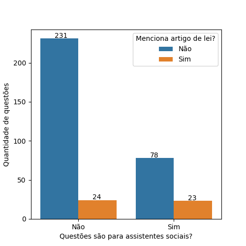
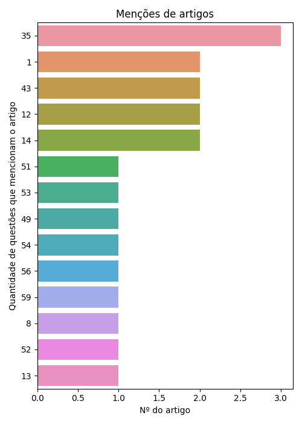
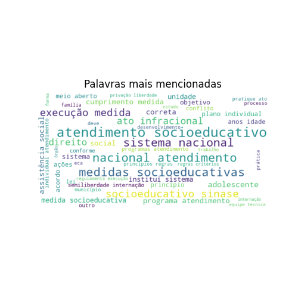
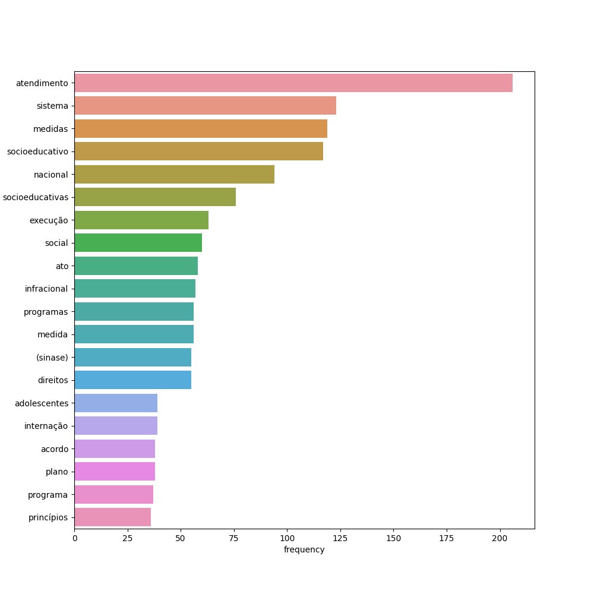
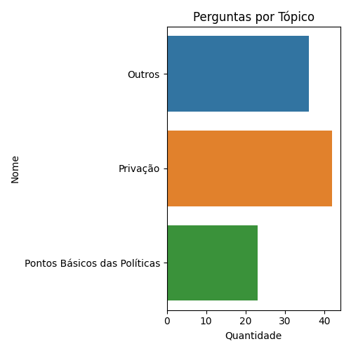
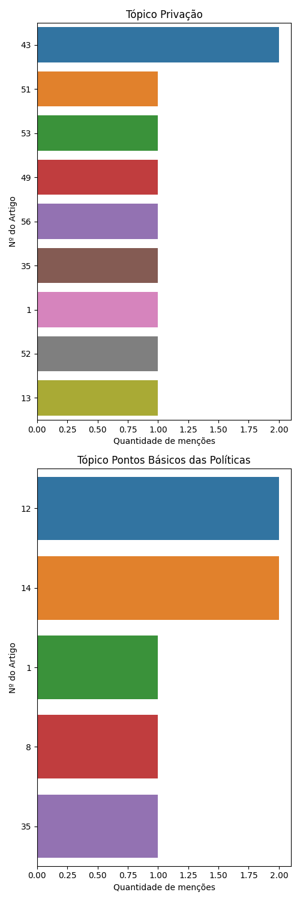

# Sinase

De 356 questões a respeito da legislação Sinase retiradas do QConcursos, 101 eram voltadas para provas de assistentes sociais.

Destas, 23 questões mencionam artigos de lei específicos.

## Análise de Artigos Pedidos Explicitamente

Como algumas questões mencionam mais de um artigo de lei, há a menção de 20 artigos em meio a estas 23 questões. O gráfico a seguir ilustra os artigos pedidos:

## Análise dos demais dados

Se considerarmos todos os dados, não só os que mencionam artigos, teremos as seguintes palavras como as mais citadas:

### Análise de tópicos

Com o uso da tecnologia de Processamento de Linguagem Natural (Bertopic), foi gerado um modelo de tópicos a respeito de nosso conjunto completo de questões. Estes tópicos organizam quais os principais grupos de questão associados à lei em questão.

<table border="1" class="dataframe">
  <thead>
    <tr style="text-align: right;">
      <th></th>
      <th>Nº</th>
      <th>Nome</th>
      <th>Palavras-Chave</th>
      <th>Count</th>
    </tr>
  </thead>
  <tbody>
    <tr>
      <th>0</th>
      <td>-1</td>
      <td>Outros</td>
      <td>[administração, políticas, institui, socioeducativas, direitos, pública, infracional, socioeducativo, idade, estatuto]</td>
      <td>36</td>
    </tr>
    <tr>
      <th>1</th>
      <td>0</td>
      <td>Privação</td>
      <td>[socioeducativa, regulamenta, socioeducativas, socioeducativo, infracional, privação, intervenção, direitos, institui, social]</td>
      <td>42</td>
    </tr>
    <tr>
      <th>2</th>
      <td>1</td>
      <td>Pontos Básicos das Políticas</td>
      <td>[socioeducativas, socioeducativo, políticas, educação, atendimento, critérios, municipais, entidades, desenvolvimento, social]</td>
      <td>23</td>
    </tr>
  </tbody>
</table>

Se observarmos os artigos pedidos em cada tópico, teremos os seguintes gráficos:

